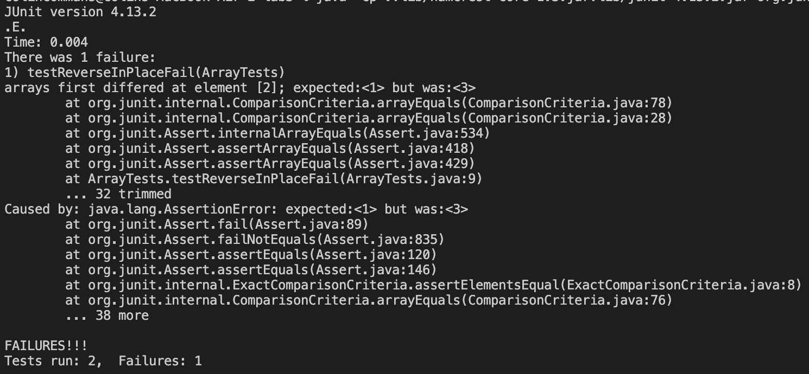

## Introduction
This lab concerned web servers, testing code, bug fixing. JUnit allows us to test specific methods and failure-inducing inputs in order to more accurately determine bugs in a program. This lab report will examine the creation of a web server and fixing a specific bug in an arrays method. 

## Part 1
```
import java.io.IOException;
import java.net.URI;

class Handler implements URLHandler {
    String display = "";
    public String handleRequest(URI url) {
        System.out.println("Path: " + url.getPath());
        if (url.getPath().equals("/"))
            return display;
        if (url.getPath().equals("/add-message")) {
            String[] parameters = url.getQuery().split("=");
            if (parameters[0].equals("s")) {
                if(!display.equals("")) 
                    display += "\n";
                display += parameters[1];
                return display;
            }
        }
        return "404 Not Found!";
    }
}

class StringServer {
    public static void main(String[] args) throws IOException {
        if(args.length == 0){
            System.out.println("Missing port number! Try any number between 1024 to 49151");
            return;
        }
        int port = Integer.parseInt(args[0]);
        Server.start(port, new Handler());
    }
}
```
Screenshot \#1:


- Called methods:
    - handleRequest()
    - getPath()
    - equals() (4 times on lines 8,10,12,13)
    - getQuery()
    - split()
- Relevant method arguments and field values:
    - url = "http://localhost:4000/add-message?s=hi"
    - getPath() returns "/add-message"
    - getQuery() returns "s=hi"
    - parameters array contains \["s", "hi"]
    - display String is changed from "" to "hi"

Screenshot \#2:


- Called methods:
    - handleRequest()
    - getPath()
    - equals() (4 times on lines 8,10,12,13)
    - getQuery()
    - split()
- Relevant method arguments and field values:
    - url = "http://localhost:4000/add-message?s=1234"
    - getPath() returns "/add-message"
    - getQuery() returns "s=1234"
    - parameters array contains \["s", "1234"]
    - display String is changed from "hi" to "hi\n1234"

## Part 2
Failure-inducing input:
```
@Test
public void testReverseInPlaceFail() {
    int[] input = {1,2,3};
    ArrayExamples.reverseInPlace(input);
    assertArrayEquals(new int[]{3,2,1}, input);
}
```
Non-failing input:
```
@Test 
public void testReverseInPlacePass() {
    int[] input = {3};
    ArrayExamples.reverseInPlace(input);
    assertArrayEquals(new int[]{3}, input);
}
```
Output (Symptom):



Code before bux fix:
```
static void reverseInPlace(int[] arr){
    for(int i = 0; i < arr.length; i += 1) {
        arr[i] = arr[arr.length - i - 1];
    }
}
```
Code after bug fix:
```
static void reverseInPlace(int[] arr) {
    int[] newArray = arr.clone();
    for(int i = 0; i < arr.length; i += 1) {
        arr[i] = newArray[arr.length - i - 1];
    }
}
```
Prior to the fix, the original array is being edited, starting from the beginning and moving forward, with values accessed from the same array, starting from the end and moving backward. So after the first half of the array is processed using this algorithm, the remaining elements that should be changed to elements from the front of the original array remain unchanged. The following code fixes the bug because the clone allows the first half of the original array's values to no longer be lost, so they can then be copied over to the back half of the array.

## Part 3
Week 2 lab was my first introduction to creating web servers. I had seen localhost before, but was unaware about port numbers and the fact that it was all done on my computer. To me, it was really cool seeing the code I wrote appear on a web page.
