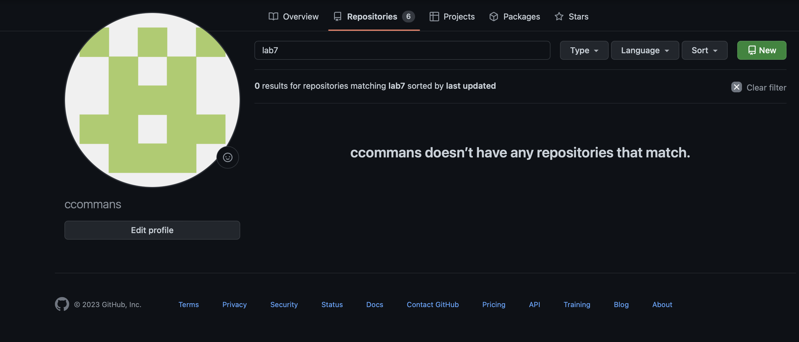
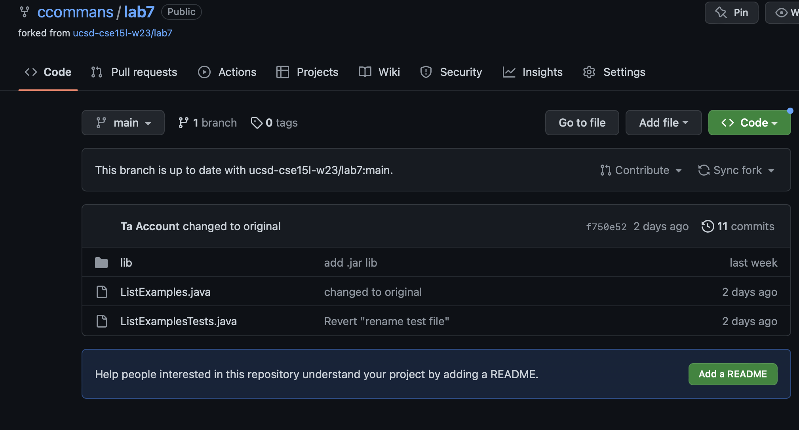
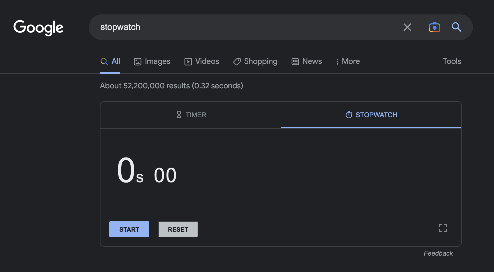
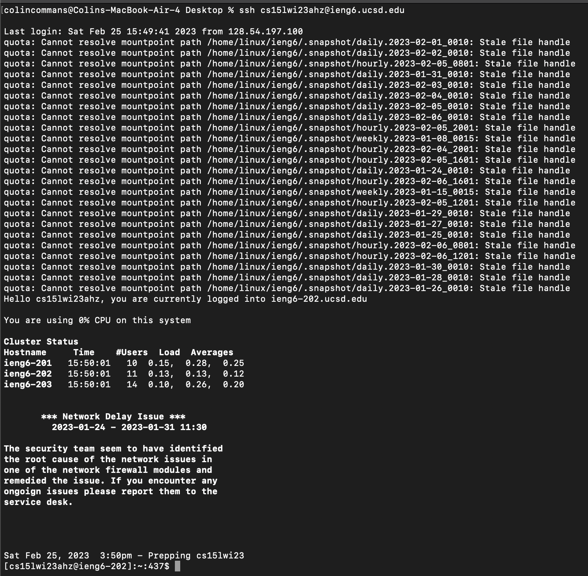
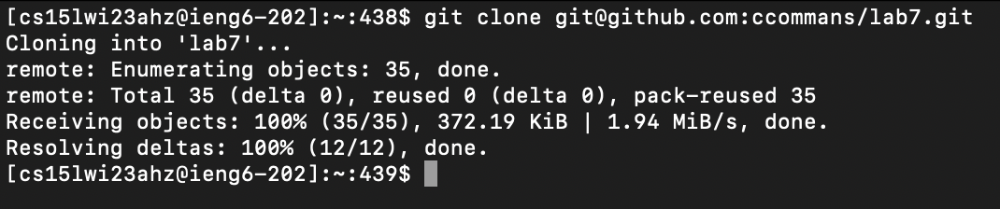
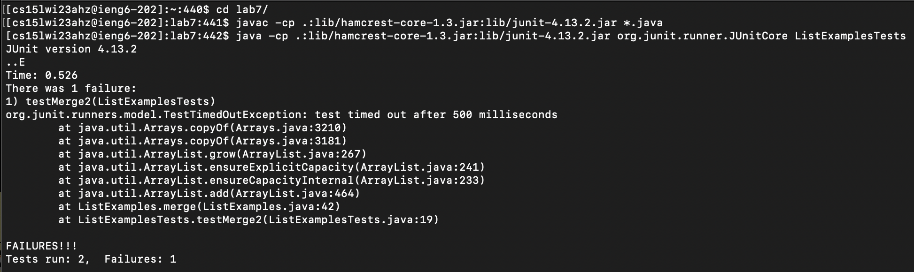
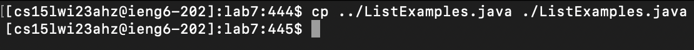
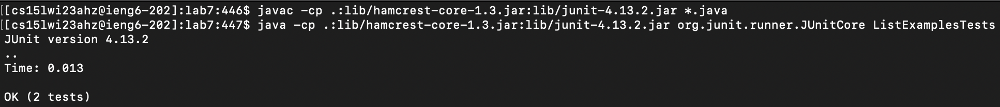
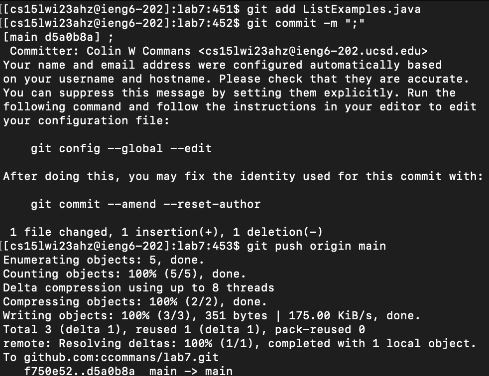
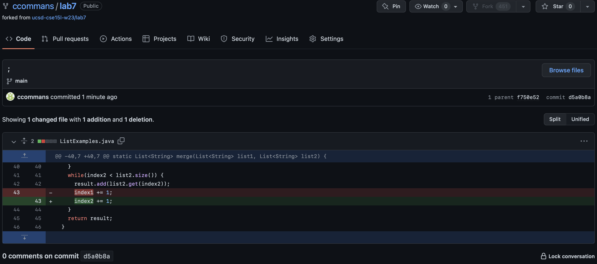

## Introduction
After a bit of practice and learning some tips from the people in my group, I was able to get my 1 min. 50 sec. baseline down a whole minute to 50 sec. This report will examine the specific keys I typed to achieve that lower time as well as the effect of those commands for each step of the task.

> NOTE: Steps 1–3 are setup steps and thus have no log of input keys

## 1. Delete any existing forks of the repository you have on your account

## 2. Fork the repository

## 3. Start the timer!

---

**Now the challenge officially starts!**

# 4. Log into ieng6

*Keys pressed:* ``<ctrl> r s s <enter>``

*Effect:* This searched through my past commands for `ssh cs15lwi23ahz@ieng6.ucsd.edu` without having to actually type each character of that long command. Additionally, ssh-keygen was used prior to ensure that no password had to be inputted upon login.

## 5. Clone your fork of the repository from your Github account

*Keys pressed:* ``<cmd> c <cmd> p``

*Effect:* There's no helpful autocomplete with ``<tab>`` for this step, so the only alternative to typing the entire command out that I could think of is having a text document that I could copy/paste from. Since the remote login takes some time on its own, I can copy the command as that is running to save a little bit of time. It is also noteworthy to memtion that the command runs immediately after pasting, no ``<enter>`` key was required to be hit.

## 6. Run the tests, demonstrating that they fail

*Keys pressed:* ``c d <space> l <tab> <enter> <cmd> c <cmd> p <enter> <cmd> c <cmd> p``

*Effect:* Using ``<tab>`` saves a bit of time for the ``cd lab7/`` and like before, the fastest solution I could come up with for the ``javac`` and ``java`` commands was copying and pasting from an outside text file. Interestingly, ``javac`` needed the ``<enter>`` key to be hit after pasting, but not ``java``

## 7. Edit the code file to fix the failing test

*Keys pressed:* ``c p <space> . . / L i <tab> . / L i <tab> j a v a ``

*Effect:* ``<tab>`` clearly does a lot of heavy lifting in this step for both arguments of the ``cd`` command. This is the step where I saved the most time from my baseline because I do not have to use ``nano`` or something similiar to directly change the code in the terminal. Instead, I had a correctly-written ``ListExamples.java`` in my home directory that I simply copied over to replace the one in my current directory. I also found that typing out java was faster for me than the arguably quicker ``j <tab>``

## 8. Run the tests, demonstrating that they now succeed

*Keys pressed:* ``<up> <up> <up> <enter> <up> <up> <up> <enter> ``

*Effect:* This was another big time save becuase I previously had forgotten about the up and down arrows to traverse my command history. The ``javac`` and ``java`` commands are the exact same as before, and this was the fastest way for me to access and re-enter them.

## 9. Commit and push the resulting change to your Github account

*Keys pressed:* ``g i t a d d L i <tab> . j a v a <enter> g i t c o m m i t - m " ; " <enter> g i t p u s h o r i g i n m a i n <enter>``

*Effect:* The ``git`` commands, apart from the file name, cannot be sped up using ``<tab>``, but I figured that since they were short enough I could just manually type them out. The semicolon is used for the commit message because the message cannot be empty and the semicolon key is right next to the quotation mark key to ensure that no time is wasted.
