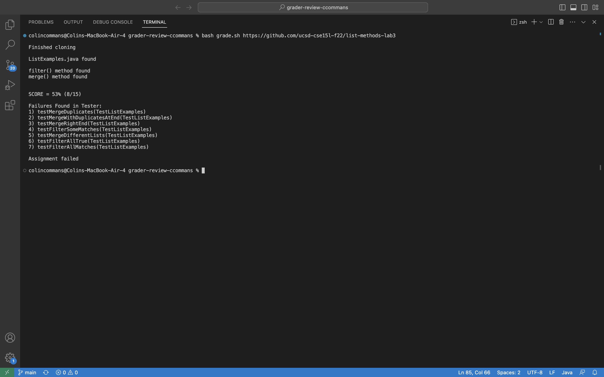
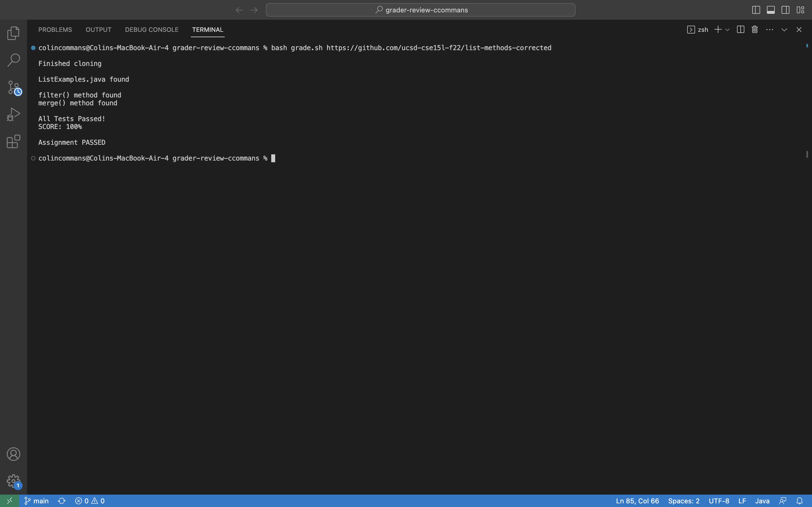
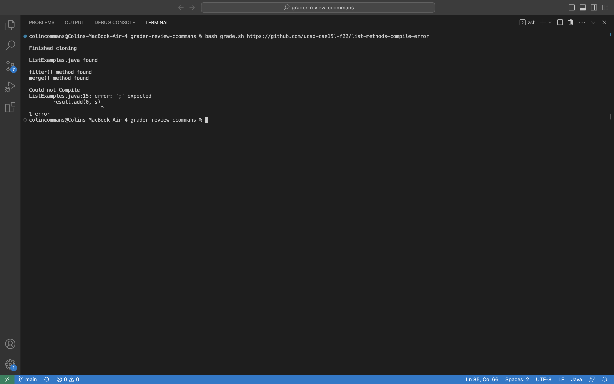
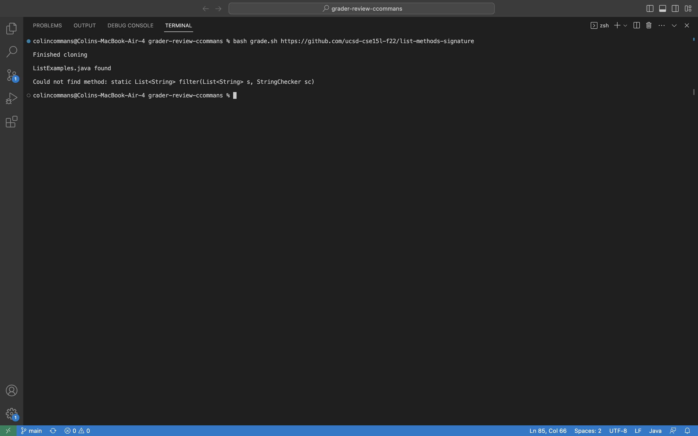
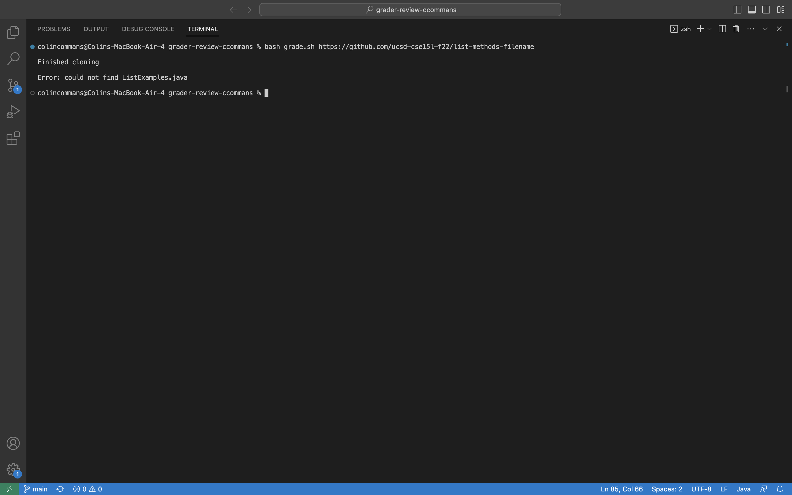
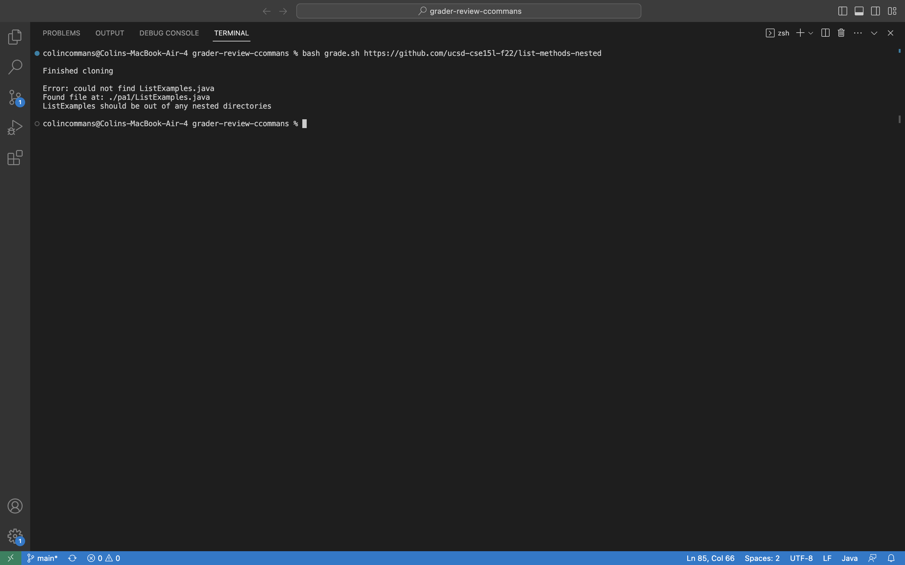
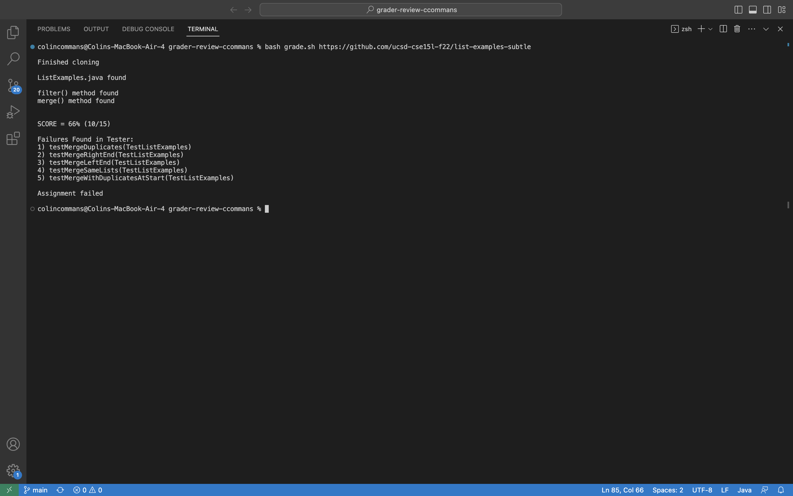

## Introduction
For my final lab report, I will be finishing my grading script and using it on all of the example repositories. I had finished a good amount of the script in labs, but I still had to work on the grade calculation as well as write some JUnit tests to check the functionality of my script. This was done in hopes of better preparation for the upcoming skill demonstration.

## The Script
The script, in its entirety:
```
CPATH='.:lib/hamcrest-core-1.3.jar:lib/junit-4.13.2.jar'

#Clone the repository of the student submission to a well-known directory name (provided in starter code)

rm -rf student-submission
#Wanted to clean up output of clone, used help from StackOverflow
git clone --progress $1 student-submission 2> clone-output.txt
mv clone-output.txt student-submission/clone-output.txt
echo
echo 'Finished cloning'
echo

#Check that the student code has the correct file submitted. If they didn’t, detect and give helpful feedback about it.

cd student-submission
if [[ -e ListExamples.java ]]
then
    echo "ListExamples.java found"
    echo
else
    echo "Error: could not find ListExamples.java"
    LOOKUP=`find . -name "ListExamples.java"`
    if [[ $LOOKUP == *ListExamples.java* ]]
    then
        echo "Found file at: $LOOKUP" 
        echo "ListExamples should be out of any nested directories"
    fi
    echo
    exit
fi

#Check for expected method signatures

CODE=`cat ListExamples.java`
if [[ $CODE == *static?List?String??filter?List?String?*,?StringChecker* ]]
then
    echo 'filter() method found'
else
    echo 'Could not find method: static List<String> filter(List<String> s, StringChecker sc)'
    echo
    exit
fi
if [[ $CODE == *static?List?String??merge?List?String?*,?List?String?* ]]
then
    echo 'merge() method found'
else
    echo 'Could not find method: static List<String> merge(List<String> list1, List<String> list2)'
    echo
    exit
fi
echo

#Somehow get the student code and your test .java file into the same directory

cp ../GradeServer.java ./
cp ../TestListExamples.java ./
cp -r ../lib ./
cp ../Server.java ./

#Compile your tests and the student’s code from the appropriate directory with the appropriate classpath commands. 
#If the compilation fails, detect and give helpful feedback about it.

javac -cp $CPATH *.java 2>javac-errors.txt
if [[ $? -ne 0 ]]
then
    echo Could not Compile
    cat javac-errors.txt
    exit
fi

#Run the tests and report the grade based on the JUnit output.

java -cp $CPATH org.junit.runner.JUnitCore TestListExamples >junit-results.txt
RESULT=`cat junit-results.txt`

if [[ $RESULT == *OK* ]]
then
    echo All Tests Passed!
    echo SCORE: 100%
    echo
    echo Assignment PASSED
    echo
    exit
fi

TESTS_RUN=`grep -o 'Tests run: [[:digit:]]\+' junit-results.txt | grep -o '[[:digit:]]\+'`
TESTS_FAILED=`grep -o 'Failures: [[:digit:]]\+' junit-results.txt | grep -o '[[:digit:]]\+'`

PASSED=$(( $TESTS_RUN - $TESTS_FAILED ))
SCORE=$(( $PASSED * 100 / $TESTS_RUN))
echo
echo SCORE = $SCORE% \($PASSED/$TESTS_RUN\)


if [[ $RESULT  == *FAILURES!* ]]
then
    echo
    echo Failures Found in Tester:
    grep '[[:digit:]]\+) ' junit-results.txt
    echo
    echo Assignment failed
fi
echo
```
Some noteworthy lines include:

- `git clone --progress $1 student-submission 2> clone-output.txt`

I found this helpful to clean up some of the output that `git clone` command naturally creates. Interestingly, more than a simple output redirection was needed, but I was able to find a solution on [this StackOverflow post](https://stackoverflow.com/questions/37669115/how-to-capture-full-output-of-git-clone).

- `if [[ $CODE == *static?List?String??filter?List?String?*,?StringChecker* ]]`

This was my brute-force approach to checking for the correct method signatures, where `static List<String> filter <List>String> s, StringChecker sc` becomes this odd but precise mix of `?` and `*` characters. `?` represents a single wildcard character; `*` represents an indeterminate amount of wildcard characters.

- ``` TESTS_RUN=`grep -o 'Tests run: [[:digit:]]\+' junit-results.txt | grep -o '[[:digit:]]\+'` ```

This is the beginning of the grade calculation portion, and was by far the most difficult part of writing this script. After numerous StackOverflow posts, I was able to piece together some sort of understanding of how to parse the JUnit output. Essentially, I use  `grep` twice: 
 1. the first `grep` looks for and returns only (purpose of the  `-o` option) the string of characters "Tests run: *D*", where *D* represents one (or more, hence the `\+`) digits.
 2. The second `grep` then searches those characters for only the digits. Such precision is necessary because the bash arithmetic that follows cannot have anything other than digit characters.

- `SCORE=$(( $PASSED * 100 / $TESTS_RUN))`

This is the syntax of arithmetic in a bash script. Getting help from [this article](https://ryanstutorials.net/bash-scripting-tutorial/bash-arithmetic.php), I was eventually able to write this formula for grade percentage with the numbers from the `grep` commands above.

## JUnit Tester (with ChatGPT)
Given the tedium of writing JUnit tests, I figured I could get some help using ChatGPT. I gave it the method descriptions and signatures for the merge() and filter() methods, along with the few inital tests given, and asked it to create more tests for those methods.

This test for filter() in particular suprised me because of how it utilized only the StringChecker looking for "moon" to create:
```
@Test(timeout = 500)
  public void testFilterSomeMatches() {
    List<String> input = Arrays.asList("sun", "moon", "stars", "Moon", "galaxy");
    List<String> expected = Arrays.asList("moon", "Moon");
    List<String> filtered = ListExamples.filter(input, new IsMoon());
    assertEquals(expected, filtered);
  }
```
which uses other astronomical words in its example List. Other tests like:
```
@Test(timeout = 500)
  public void testMergeDifferentLists() {
    List<String> list1 = Arrays.asList("a", "c", "e");
    List<String> list2 = Arrays.asList("b", "d", "f");
    List<String> merged = ListExamples.merge(list1, list2);
    List<String> expected = Arrays.asList("a", "b", "c", "d", "e", "f");
    assertEquals(expected, merged);
  }
```
surprised me as well because of how it similarly ran with the theme of Lists with lowercase letters for merge() tests. Regardless, I had more tests to ensure all the parts of my grading script, the grade calculation especially, ran as expected.

## Example Repositories
The example reposititores can be found on [Week 6 Lab](https://ucsd-cse15l-w23.github.io/week/week6/)
1. list-methods-lab3


2. list-methods-corrected 
 

3. list-methods-compile-error 


4. list-methods-signature 
 

5. list-methods-filename 


6. list-methods-nested 


7. list-examples-subtle 

